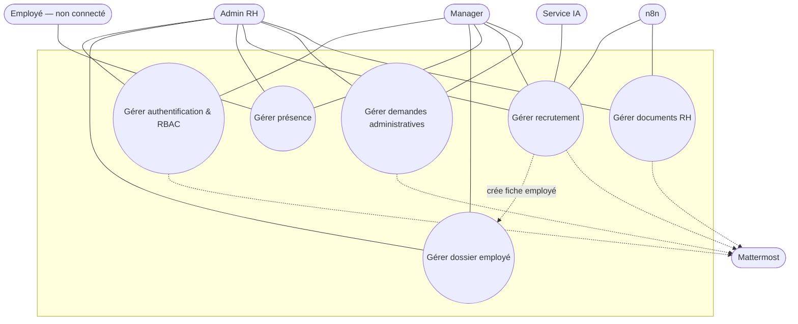
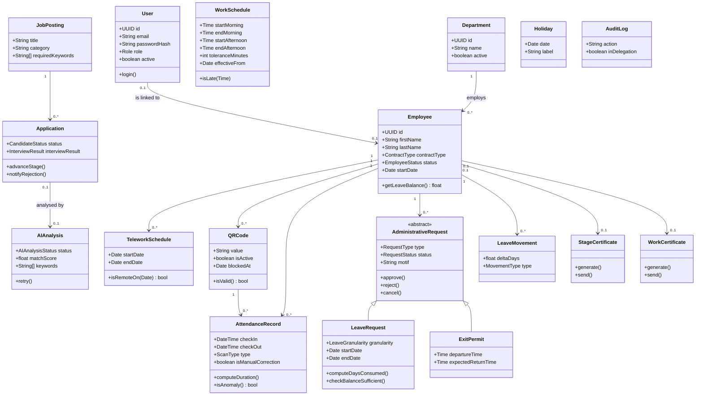
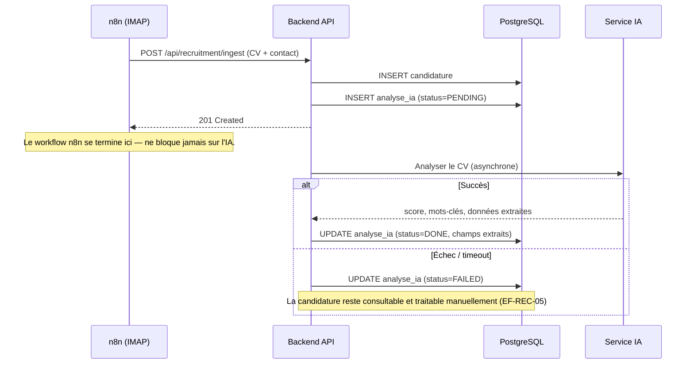
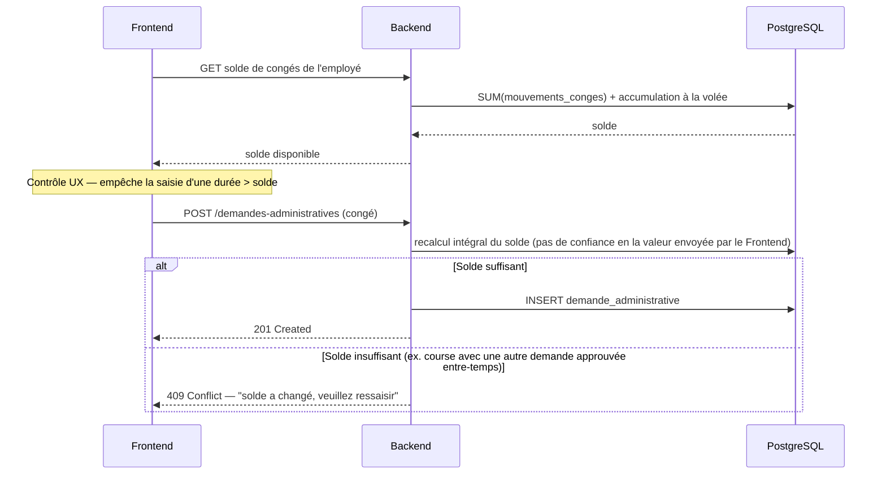

# Rapport complet du projet — Mentora (Gestion Entreprise RH)

> **But de ce document.** Rassembler en un seul fichier tout ce qui est nécessaire pour comprendre le projet de A à Z — contexte, périmètre, architecture technique, modèle de données, règles métier, historique des décisions — et pour être capable, à partir de son seul contenu, de reconstituer l'intégralité des diagrammes UML (cas d'utilisation, classes, séquence, données) ainsi qu'un rapport de stage/projet complet. Il consolide et synthétise les documents `01-requirements.md`, `02-diagrams-README.md`, `03-schema-README.md`, `04-deploiement.md` et `avancement-projet.md`, plus l'historique réel de développement (bugs trouvés, corrections, décisions prises en cours de route). En cas de divergence entre ce document et le code réellement livré, **le code fait foi** — ce document est une synthèse pédagogique, pas une nouvelle source de vérité.
>
> **Auteurs :** Achraf (ENSA Tétouan, stagiaire) et Taha, sous l'encadrement d'HB Développement.
> **Statut du projet :** fonctionnellement complet côté code (tous les Must livrés, quasi-totalité des Should). Il ne reste que des blocages externes (fichiers Excel réels de la RH, confirmation DevOps) — voir §10.

---

## Table des matières

1. [Contexte et objectifs](#1-contexte-et-objectifs)
2. [Périmètre fonctionnel et acteurs](#2-périmètre-fonctionnel-et-acteurs)
3. [Architecture technique](#3-architecture-technique)
4. [Catalogue complet des exigences fonctionnelles](#4-catalogue-complet-des-exigences-fonctionnelles)
5. [Règles métier et cas limites](#5-règles-métier-et-cas-limites)
6. [Modèle de données](#6-modèle-de-données)
7. [Diagrammes UML](#7-diagrammes-uml)
8. [Sécurité](#8-sécurité)
9. [Exigences non fonctionnelles](#9-exigences-non-fonctionnelles)
10. [Historique du projet et décisions techniques majeures](#10-historique-du-projet-et-décisions-techniques-majeures)
11. [État d'avancement](#11-état-davancement)
12. [Glossaire des identifiants d'exigences](#12-glossaire-des-identifiants-dexigences)

---

## 1. Contexte et objectifs

**Projet :** application de gestion d'entreprise, volet RH — outil interne développé pendant un stage chez **HB Développement**, destiné à l'usage quotidien du service RH de l'entreprise.

**Problème résolu :** HB Développement gérait jusqu'ici ses processus RH (dossiers employés, présence, congés, recrutement, documents) de façon dispersée (feuilles Excel, échanges manuels, pointage physique). Mentora centralise l'ensemble dans une application web unique, avec deux rôles utilisateurs (Admin RH et Manager de département), tout en s'appuyant sur les outils déjà en place dans l'entreprise (Mattermost pour la messagerie interne, boîte e-mail pour la réception des candidatures).

**Contraintes de départ :**
- Délai de conception court (une semaine de cadrage avant la réalisation).
- Équipe de deux stagiaires, stack technique libre.
- Le projet devait être livrable à la fois comme rendu de stage et comme pièce de portfolio.
- Usage interne uniquement, en français, sans multi-société ni SSO externe.
- Le calcul de la paie et toute logique financière liée au salaire restent explicitement **hors périmètre** — le système consolide des données RH, il ne remplace pas un logiciel de paie.

**Cycle de vie employé couvert, de bout en bout :**

```
Candidat évalué (Recrutement)
   │  embauche
   ▼
Devient un employé (Dossier Employé)
   │
   ├─▶ Pointe quotidiennement (Présence)
   ├─▶ Demande congés / bons de sortie (Demandes Administratives)
   └─▶ Reçoit ses documents RH (Documents RH)
```

Trois modules transverses complètent l'ensemble : **Export & Reporting** (extraction des données affichées à l'écran), **Configuration & Paramétrage** (identité de l'entreprise + consultation du journal d'audit), et **Notifications internes** (centre in-app, canal de repli garanti indépendant de Mattermost).

---

## 2. Périmètre fonctionnel et acteurs

### 2.1 Modules métier

| Module | Code exigences | Statut |
|---|---|---|
| Authentification & Contrôle d'accès (RBAC) | EF-AUTH | Confirmé — inclut la délégation temporaire d'approbation |
| Tableau de bord | EF-DASH | Confirmé — minimal, sans graphiques |
| Dossier Employé | EF-EMP | Confirmé — module central, inclut le suivi de fin de contrat CDD |
| Présence (pointage QR/badge) | EF-ATT | Confirmé — pointage mobile personnel (v2, remplace le kiosque partagé initial) |
| Recrutement (ingestion CV + IA) | EF-REC | Confirmé |
| Demandes Administratives | EF-ADM | Confirmé — congés, demi-journées, bons de sortie, congés légaux spéciaux, documents libres |
| Documents RH | EF-DOC | Confirmé — certificats, attestations, généralisé à l'offboarding CDI/CDD |
| Export & Reporting | EF-EXP | Confirmé — transverse |
| Configuration & Paramétrage | EF-CFG | Confirmé — transverse |
| Notifications internes | EF-NOTIF | Confirmé — transverse |

### 2.2 Contexte organisationnel

- L'entreprise compte au moins 3 départements, chacun doté d'un manager dédié.
- **L'approbation des demandes administratives est centralisée** auprès d'une seule personne : l'Admin RH (dans la réalité de l'entreprise, Mme Amal Medah). Les Managers de département n'ont **aucun rôle d'approbation** — leur rôle est limité à la consultation des données de leur propre équipe (et, temporairement, à l'exercice de droits d'approbation délégués — cf. EF-AUTH-11).
- Le recrutement est géré par l'Admin RH (réception, sélection). Une fois un candidat présélectionné, le Manager du département concerné conduit l'entretien.
- Il n'existe **que deux rôles applicatifs** : `admin` et `manager`. Il n'y a pas de rôle "Recruteur" ni "Chef de Projet" distinct — leurs fonctions sont couvertes respectivement par Admin et Manager.
- **Un Manager est aussi un employé** (EF-EMP-18, ajout tardif) : chaque compte Manager est obligatoirement lié à sa propre fiche RH (département, poste, type de contrat, date d'embauche), créée atomiquement avec le compte. Un Manager peut donc lui-même poser une demande de congé, apparaître dans un export, etc., exactement comme n'importe quel employé.

### 2.3 Acteurs du système

Le cahier des charges ne définit que 2 acteurs **connectés** (Admin et Manager), mais 4 autres intervenants déclenchent ou reçoivent des actions sans jamais se connecter — ils sont modélisés comme acteurs **secondaires**, essentiels pour que les diagrammes de cas d'utilisation restent fidèles au comportement réel du système.

| Acteur | Type | Rôle |
|---|---|---|
| **Admin RH** | Primaire, connecté | Accès complet : employés, présence, recrutement, demandes, documents, configuration |
| **Manager** | Primaire, connecté | Lecture scopée à sa propre équipe (`employes.manager_id`) + saisie de résultat d'entretien + (si délégué actif) droits d'approbation temporaires |
| **Employé** | Secondaire, non connecté | Pointe depuis son téléphone personnel appairé, en scannant le QR affiché sur le lieu de travail |
| **n8n** | Secondaire, externe | Orchestrateur : déclenche l'ingestion de candidatures (IMAP → webhook) et relaie tous les envois SMTP sortants |
| **Service IA** (OpenRouter) | Secondaire, externe | Analyse les CV, retourne un score de correspondance et une justification |
| **Mattermost** | Secondaire, externe | Réceptionne les notifications métier sortantes (webhook) |

Un cas d'utilisation relié à **n8n** ou au **Service IA** représente un comportement **automatique**, jamais une action humaine à déclencher manuellement.

### 2.4 Règles légales structurantes (droit marocain du travail)

- **Congé payé** : CDI/CDD → 1,5 jour ouvrable/mois travaillé (18 j/an à plein temps, plafond). Stagiaire / Stagiaire rémunéré → **aucun droit à congé payé**.
- Le solde de congés démarre à **0** à la date d'embauche et s'accumule progressivement — jamais disponible en totalité dès le premier jour. Calculé **à la volée** (`1,5 × mois travaillés écoulés − jours consommés + jours recrédités`), sans job planifié ni champ stocké mutable (registre de mouvements, cf. §6).
- Un changement de type de contrat en cours d'année (ex. stagiaire promu CDI) **n'est jamais recalculé automatiquement** — l'Admin RH effectue les ajustements nécessaires manuellement.
- Les demandes de congé peuvent couvrir des journées complètes ou des demi-journées (matin / après-midi).
- Un employé CDI/CDD sortant a droit à un **certificat de travail** ; un stagiaire sortant a droit à un **certificat de stage** (numérique) + une **attestation de stage** (physique, remise en main propre).

---

## 3. Architecture technique

### 3.1 Vue d'ensemble

```
┌─────────────────┐        ┌──────────────────┐        ┌─────────────────┐
│  Mentora-fe      │  HTTP  │  Mentora-be       │  JDBC  │  PostgreSQL 14+ │
│  React + Vite    │───────▶│  Spring Boot 3    │───────▶│  (unique)       │
│  nginx (prod)    │        │  Java 21          │        └─────────────────┘
└─────────────────┘        └────────┬──────────┘
                                     │ webhook / SMTP
                            ┌────────▼──────────┐        ┌─────────────────┐
                            │  n8n               │───────▶│  Mattermost     │
                            │  (transport pur :   │        │  (notif. sort.) │
                            │  IMAP + SMTP)       │
                            └────────┬───────────┘
                                     │
                            ┌────────▼──────────┐
                            │  Service IA        │
                            │  (OpenRouter)       │
                            └────────────────────┘
```

**Deux dépôts Git distincts, deux pipelines CI/CD, deux images Docker :**
- `Mentora-managment-be` — dépôt **pivot** : backend Spring Boot, `docker-compose.yml` de la stack complète, migrations Flyway, workflows n8n, toute la documentation (`docs/`).
- `Mentora-managment-fe` — frontend React seul.

Le pivot est backend : le `docker-compose.yml` du dépôt `be` référence `../Mentora-managment-fe` comme contexte de build du service `frontend` — les deux dépôts doivent être clonés côte à côte dans un même dossier parent pour que `docker compose up` fonctionne.

### 3.2 Stack technique détaillée

**Backend (`Mentora-managment-be`)**
- Java 21, Spring Boot 3.5.x, Maven (wrapper `mvnw`).
- Architecture **feature-based vertical slice** : un package par module métier (`ma.hbdev.rh.<module>`), chacun contenant ses propres `Controller`/`Service`/`Repository`/`Entity`/DTOs, la majorité des classes en visibilité **package-private**. Les échanges entre modules passent soit par l'import du **service public** d'un autre module (convention établie : `document.DocumentRhService` importe `employee.EmployeService`/`EmployeReponse`), soit par des lectures JDBC brutes en lecture seule pour des besoins transverses ponctuels (ex. `DashboardService`, qui agrège plusieurs modules sans dépendre de leurs repositories package-private).
- Spring Data JPA + Hibernate pour la persistance, Spring Security (JWT stateless, `@PreAuthorize` sur chaque endpoint sensible).
- **Flyway** pour les migrations de schéma, exécutées automatiquement au démarrage (38+ migrations à date, `V1` = schéma initial + télétravail, `V2` = données de référence).
- springdoc-openapi pour l'exposition du contrat d'API (`/v3/api-docs`), exporté vers `contracts/openapi.json` — consommé par le frontend pour générer ses types TypeScript (jamais édités à la main).
- Spotless (Google Java Format) + Checkstyle pour le formatage/lint, appliqués en hook pre-commit et en CI.
- Tests : JUnit 5 + Testcontainers (PostgreSQL 14 réel, pas de H2) pour les tests d'intégration ; ~240 tests au total à ce stade du projet.

**Frontend (`Mentora-managment-fe`)**
- React 18 + TypeScript, Vite comme bundler/dev-server.
- React Router (data router) pour la navigation, TanStack Query pour la gestion des requêtes serveur (cache, invalidation), react-hook-form + zod pour les formulaires et leur validation.
- Système de design maison (pas de bibliothèque de composants tierce complète) : palette de couleurs propre à HB Développement (marine `#1B2A41`, or `#D4A64A`, vert sauge `#4A7C6B`, fond crème `#F7F7F4`), composants UI réutilisables sous `src/components/ui/` (`Button`, `Dialog`, `Select`, `PersonSearch` — typeahead de recherche de personne, `EmailLink`/`WhatsappLink`, `SortableTh`, etc.).
- `openapi-typescript` régénère `src/types/api.ts` depuis `contracts/openapi.json` du backend à chaque changement de contrat d'API (`npm run generate:types`).
- ESLint (flat config) + Prettier, Vitest + Testing Library pour les tests (~71 tests à ce stade).
- Build de production servi par nginx (image non-root, écoute sur `8081`).

**Orchestration & services annexes**
- **n8n** (`n8nio/n8n:2.29.8`) : couche de transport pure, deux workflows versionnés (`n8n/workflows/`) — un webhook IMAP → `POST /api/recruitment/ingest` (ingestion de candidatures), un webhook générique → envoi SMTP (tous les e-mails sortants de l'application transitent par ce seul canal : réinitialisation de mot de passe, certificats/documents RH, rejet de candidature, code d'activation et lien de révocation du pointage mobile).
- **Mailpit** (dev uniquement) : serveur SMTP + UI web de capture des e-mails, pour tester les envois sans vrai service de messagerie.
- **pgAdmin** (dev uniquement) : administration visuelle de la base Postgres.

### 3.3 Déploiement

| Composant | Image | Port | Volume |
|---|---|---|---|
| Backend | `eclipse-temurin:21-jre-alpine`, utilisateur non-root `rh` | `8080` | PVC requis (fichiers uploadés sur disque, `ReadWriteMany` si plusieurs réplicas) |
| Frontend | `nginxinc/nginx-unprivileged:alpine`, utilisateur non-root `101` | `8081` (pas `80` : nginx non-root ne peut pas se lier à un port privilégié) | Aucun |
| PostgreSQL | `postgres:14-alpine` | `5432` | PVC requis |
| n8n | `n8nio/n8n:2.29.8` | `5678` | PVC (petit) |

Les deux images backend/frontend sont publiées sur GHCR (`ghcr.io/mentora-ma/mentora-management-{be,fe}`), taguées `latest` et `sha-<court>`, gated par un scan Trivy (le job échoue et n'atteint jamais le push si une CVE `CRITICAL`/`HIGH` non corrigeable est détectée).

**Healthchecks** : `GET /actuator/health/liveness` (process seul, sans la base — une panne DB ne redémarre jamais le pod) et `GET /actuator/health/readiness` (process + connectivité Postgres). Aucun autre endpoint Actuator exposé publiquement.

**Point de vigilance connu (non résolu, signalé à l'équipe DevOps)** : le backend exécute 5 tâches planifiées nocturnes (archivage notifications, expiration délégations, surveillance documents RH, archivage recrutement...), sans coordination inter-pods — à 1 réplica (cas nominal actuel) aucun problème, mais un scaling horizontal futur dupliquerait chaque tâche par pod.

Détail complet des variables d'environnement, des ports, des volumes et des points de vigilance dans `docs/04-deploiement.md`.

---

## 4. Catalogue complet des exigences fonctionnelles

> Convention : chaque exigence porte un code `EF-<MODULE>-<NUMERO>`. Les exigences marquées *(nouveau)* ont été ajoutées après la version initiale du cahier des charges, au fil des sessions de conception/développement — elles restent des exigences à part entière, pas des extras optionnels.

### 4.1 Authentification & RBAC (EF-AUTH)

| Code | Résumé |
|---|---|
| EF-AUTH-01 | Connexion identifiant/mot de passe pour Admin et Manager |
| EF-AUTH-02 | RBAC appliqué **côté serveur** sur chaque endpoint |
| EF-AUTH-03 | Manager : lecture seule sur sa propre équipe (dossiers, présence, demandes), aucun droit d'approbation/modification |
| EF-AUTH-04 | Manager : accès aux candidatures au stade "Entretien" pour son département |
| EF-AUTH-05 | Admin : accès complet à tous les modules + configuration |
| EF-AUTH-06 | Journalisation des tentatives de connexion (réussies et échouées) |
| EF-AUTH-07 | Admin : création/modification/désactivation des comptes utilisateurs |
| EF-AUTH-08 | Réinitialisation de mot de passe par lien e-mail à durée limitée |
| EF-AUTH-09 | Verrouillage de compte après échecs consécutifs (défaut 5), déverrouillage auto/manuel |
| EF-AUTH-10 | Expiration de session par inactivité + déconnexion explicite |
| EF-AUTH-11 | **Délégation temporaire** : Admin désigne un délégué (autre Admin ou Manager élevé temporairement) avec date de début/fin, obtenant les droits d'approbation |
| EF-AUTH-12 | La délégation porte **uniquement** sur les droits d'approbation, jamais sur la gestion de comptes/configuration/désactivation |
| EF-AUTH-13 | Expiration automatique à la date de fin, révocation manuelle possible à tout moment |
| EF-AUTH-14 | Toute action en délégation est journalisée avec mention explicite (identité délégué + Admin délégant) |
| EF-AUTH-15 | Notification Mattermost à tous les Managers au début/fin d'une période de délégation |

### 4.2 Tableau de bord (EF-DASH)

| Code | Résumé |
|---|---|
| EF-DASH-01 | Vue Admin : employés actifs (total + par département), demandes en attente, anomalies du jour, candidatures en attente, stagiaires finissant sous 7 jours |
| EF-DASH-02 | Vue Manager réduite à sa propre équipe |
| EF-DASH-03 | Chaque compteur cliquable → liste filtrée correspondante |
| EF-DASH-04 | Données rafraîchies à chaque chargement de page |
| EF-DASH-05 | Bandeau "délégation active" sur le tableau de bord Admin quand une délégation est en cours |

### 4.3 Dossier Employé (EF-EMP)

| Code | Résumé |
|---|---|
| EF-EMP-01 | Création de fiche employé (identité, contact, poste, département, date d'embauche, type de contrat, manager) |
| EF-EMP-02 | Modification et désactivation (départ) sans suppression physique |
| EF-EMP-03 | Rattachement de documents à la fiche (contrat, pièce d'identité...) |
| EF-EMP-04 | Liste filtrable (département, manager, type de contrat, statut) + recherche texte libre |
| EF-EMP-05 | Génération auto de fiche employé pré-remplie à l'embauche d'un candidat (données extraites par l'IA) |
| EF-EMP-06 | Un employé / un seul manager direct (pas de structure matricielle) |
| EF-EMP-07 | Import en masse Excel/CSV (employés, présence, soldes de congés, extensible) — dry-run fidèle à l'import réel, choix Écraser/Ignorer un doublon |
| EF-EMP-08 | Blocage de la désactivation d'un Manager ayant des employés actifs rattachés |
| EF-EMP-09 | Carte employé (photo, nom, poste, département, QR) — numérique + imprimable PDF 85×54mm |
| EF-EMP-10 | CRUD département, blocage de désactivation si employés actifs rattachés |
| EF-EMP-11 | Transfert d'employé entre départements/managers, traçabilité (date d'effet, ancien/nouveau rattachement) |
| EF-EMP-12 | Recherche texte libre (nom/prénom/e-mail) sur la liste des employés |
| EF-EMP-13 | Notification Mattermost au Manager du département à la création d'une fiche |
| EF-EMP-14 | Génération de cartes employé **en lot** (PDF unique regroupant plusieurs cartes) |
| EF-EMP-15 | Date de fin de contrat prévue pour un CDD (optionnelle) |
| EF-EMP-16 | Distinction stricte entre date de fin de contrat *prévue* (CDD) et date de départ *effective* (saisie au départ) |
| EF-EMP-17 | Conformité RH Maroc (CNSS, AMO, CIMR, RIB, fin de période d'essai) + salaire brut mensuel (Admin uniquement) |
| EF-EMP-18 | **Un Manager est aussi un employé** — fiche RH créée atomiquement avec le compte, périmètre d'accès basé sur `employes.manager_id` (assignation individuelle, pas rattachement de département) |

### 4.4 Présence (EF-ATT)

| Code | Résumé |
|---|---|
| EF-ATT-01 | QR code unique par employé, généré une seule fois à la création, blocable par l'Admin |
| EF-ATT-02 | Scan entrée/sortie horodatés — deux scans par jour uniquement |
| EF-ATT-03 | Temps de présence = (sortie − entrée) − 1h de pause fixe |
| EF-ATT-04 | Détection d'anomalies : retard, départ anticipé, absence de check-out, présence incomplète |
| EF-ATT-05 | Consultation de l'historique de présence (employé/équipe, période) |
| EF-ATT-06 | Correction manuelle de pointage par l'Admin, tracée |
| EF-ATT-07 | Horaire de référence entreprise configurable, historisé (date d'effet) |
| EF-ATT-08 | Planning de télétravail hybride par employé (jours de la semaine, période) |
| EF-ATT-09 | Neutralisation des anomalies un jour couvert par un planning de télétravail actif |
| EF-ATT-10 | Planning de télétravail consultable depuis la fiche employé, distingué dans l'historique/exports |
| EF-ATT-11 | Seuil configurable d'anomalies non résolues → notification d'alerte au Manager |
| EF-ATT-15 | Vue "Présence aujourd'hui" — statut du jour par employé, filtres, navigation vers la fiche |
| EF-ATT-16 | Appairage d'un appareil personnel via code d'activation à 4 chiffres, envoyé par e-mail à la création du compte |
| EF-ATT-17 | Pointage mobile : second facteur physique obligatoire — scan d'un QR de site affiché sur place |
| EF-ATT-18 | Code d'activation à 4 chiffres, régénérable (invalide l'ancien), jamais ré-affichable en clair |
| EF-ATT-19 | Lien de révocation à usage unique dans chaque e-mail de code — auto-révocation sans intervention Admin |

### 4.5 Recrutement (EF-REC)

| Code | Résumé |
|---|---|
| EF-REC-01 | Création d'offre d'emploi (intitulé, description, département, statut) |
| EF-REC-02 | Ingestion automatique des candidatures reçues par e-mail (n8n) |
| EF-REC-03 | Normalisation des candidatures multi-source dans une structure commune |
| EF-REC-04 | Analyse IA automatique du CV : données personnelles extraites + score de correspondance + mots-clés structurés |
| EF-REC-05 | Dégradation gracieuse si l'IA échoue/indisponible — candidature conservée, statut "analyse en attente" |
| EF-REC-06 | Consultation/tri/filtre des candidatures (score IA, offre, statut, recherche texte libre) |
| EF-REC-07 | Pipeline : Reçu → Présélectionné → Entretien → Décision → Embauché / Rejeté, + statuts transversaux "En attente"/"Archivée" |
| EF-REC-08 | Notification Mattermost au Manager du département au passage à "Entretien" |
| EF-REC-09 | Manager saisit le résultat d'entretien (favorable/défavorable + commentaire) |
| EF-REC-10 | Relance manuelle de l'analyse IA sur une candidature |
| EF-REC-11 | Candidature reçue pour une offre fermée → statut "En attente" (jamais rejetée) |
| EF-REC-12 | Réactivation automatique par mots-clés à la création d'une nouvelle offre, validation manuelle Admin, archivage au-delà de la fenêtre de rétention |
| EF-REC-13 | Passage au statut "Embauché" déclenche la création de la fiche employé |
| EF-REC-14 | E-mail de rejet automatique (corps éditable), journalisé |
| EF-REC-15 | Catégorie/vivier sur les offres d'emploi (ex. "Stagiaires") |

### 4.6 Demandes Administratives (EF-ADM)

| Code | Résumé |
|---|---|
| EF-ADM-01 | Création de demande (congé/bon de sortie/document libre/autre), contrôle du solde à la saisie |
| EF-ADM-02 | Approbation/rejet réservés à l'Admin RH (+ délégué actif) |
| EF-ADM-03 | Solde via **registre de mouvements** (ledger), pas de champ mutable, taux configurable par type de contrat |
| EF-ADM-04 | Bon de sortie : plage horaire + motif, sans impact sur le solde |
| EF-ADM-05 | Revalidation stricte côté serveur du solde à l'enregistrement (protection contre le contournement API direct) |
| EF-ADM-06 | Historique des demandes filtrable (type, statut, période) |
| EF-ADM-07 | Extensibilité du type de demande sans modification structurelle |
| EF-ADM-08 | Notification Mattermost au Manager à la décision (approbation/rejet) |
| EF-ADM-09 | Demande "document libre" : upload + envoi e-mail à un employé, journalisé |
| EF-ADM-10 | Calendrier des jours fériés (gestion manuelle, pas d'API externe — fêtes hégiriennes mobiles) |
| EF-ADM-11 | Taux d'acquisition mensuel de congés configurable par type de contrat |
| EF-ADM-12 | Périodes de blocage des demandes de congé, refus serveur si chevauchement |
| EF-ADM-13 | Congés légaux spéciaux (mariage, naissance, décès, maladie) — jamais décomptés du solde, jamais bloqués |
| EF-ADM-14 | Justificatif obligatoire (PDF/Word/JPEG/PNG) pour un congé maladie |
| EF-ADM-15 | *(implémentation)* Type "demande de document" — traité via le bouton "Envoyer un document" plutôt qu'un simple changement de statut |

### 4.7 Documents RH (EF-DOC)

| Code | Résumé |
|---|---|
| EF-DOC-01 | Surveillance planifiée (n8n) des fins de stage |
| EF-DOC-02 | Notification Mattermost unique à J-3 ouvrables avant la fin de stage, sans relance |
| EF-DOC-03 | Confirmation d'envoi par l'Admin depuis l'interface |
| EF-DOC-04 | Génération automatique du certificat de stage (PDF, pré-rempli) |
| EF-DOC-05 | E-mail au stagiaire, corps pré-rempli éditable |
| EF-DOC-06 | Journalisation de chaque envoi (date, envoyé par, destination) |
| EF-DOC-07 | Renvoi manuel du certificat de stage, tracé |
| EF-DOC-08 | Saisie obligatoire (date de départ + motif) à la désactivation d'un CDI/CDD |
| EF-DOC-09 | Affichage informatif du solde de congés restant au départ (aucun calcul financier) |
| EF-DOC-10 | Génération du certificat de travail (CDI/CDD uniquement, déclenchement manuel) |
| EF-DOC-11 | Envoi + journalisation + renvoi manuel du certificat de travail |
| EF-DOC-12 | Surveillance planifiée des fins de CDD (même mécanisme que le stage) |
| EF-DOC-13 | Notification Mattermost à J-15 ouvrables avant la fin de CDD |
| EF-DOC-14 | Relance unique à J-3 si aucune action engagée (contrairement au stage) |
| EF-DOC-15 | Annulation/recalcul des notifications planifiées si la date change ou l'employé est désactivé |
| EF-DOC-16 | Promotion CDD → CDI vide la date de fin prévue et annule la surveillance |
| EF-DOC-17 | Attestation de salaire, générée à partir du salaire brut mensuel de la fiche |

### 4.8 Export & Reporting (EF-EXP)

| Code | Résumé |
|---|---|
| EF-EXP-01 | Export de la liste des employés (Excel/PDF) |
| EF-EXP-02 | Export de l'historique de présence (feuille de présence mensuelle) |
| EF-EXP-03 | Export de l'historique des demandes administratives |
| EF-EXP-04 | Génération à la demande, données au moment de la génération (pas de job planifié) |
| EF-EXP-05 | Export mensuel des données brutes de paie (CNSS/AMO/CIMR/RIB/salaire) — sans calcul de cotisation |

### 4.9 Configuration & Paramétrage (EF-CFG)

| Code | Résumé |
|---|---|
| EF-CFG-01 | Identité de l'entreprise (raison sociale, adresse, contact, logo) — réutilisée sur les documents générés |
| EF-CFG-02 | Journalisation de toute modification de l'identité de l'entreprise |
| EF-CFG-03 | Interface de consultation du journal d'audit, filtrable (utilisateur, action, module, période) |
| EF-CFG-04 | Recherche texte libre sur le journal d'audit |
| EF-CFG-05 | Export du journal d'audit (Excel/PDF) |
| EF-CFG-06 | Journal d'audit strictement **lecture seule** — aucune modification/suppression, même par l'Admin |

### 4.10 Notifications internes (EF-NOTIF)

| Code | Résumé |
|---|---|
| EF-NOTIF-01 | Chaque notification Mattermost génère, en parallèle et systématiquement, une entrée in-app |
| EF-NOTIF-02 | Badge de notifications non lues visible depuis toute page |
| EF-NOTIF-03 | Notification cliquable → redirection vers l'élément concerné |
| EF-NOTIF-04 | Marquage lu individuel ou en masse |
| EF-NOTIF-05 | Conservation 90 jours (configurable) puis archivage automatique — pas de valeur probante |
| EF-NOTIF-06 | Échec du webhook Mattermost journalisé, l'in-app reste garanti |

---

## 5. Règles métier et cas limites

### 5.1 Dossier Employé
- Un employé désactivé conserve tout son historique (statut `inactif`, jamais de suppression physique).
- Rattachement strict à un seul manager (`manager_id` unique par employé, pas de structure matricielle).
- La désactivation d'un employé clôture/invalide automatiquement ses demandes administratives en attente.
- **Manager désactivé** : bloqué tant que des employés actifs lui sont rattachés (réaffectation explicite requise au préalable) ; sans employé actif rattaché, désactivation directe autorisée. Corollaire : chaque département conserve toujours au moins un Manager actif tant qu'il compte des employés actifs.

### 5.2 Présence
- Un scan d'entrée sans sortie correspondante en fin de journée → anomalie "présence incomplète".
- Deux scans d'entrée consécutifs sans sortie entre les deux → rejetés/signalés.
- L'horodatage fait toujours foi côté serveur, indépendamment du poste utilisé pour le scan.
- Un scan pour un employé désactivé est rejeté.
- Horaire unique pour toute l'entreprise (pas de variation par département/employé) : 08h30–13h00 / 14h00–17h00, tolérance 10 min. Modifiable et historisé — un changement ne s'applique qu'aux pointages **futurs**.
- Un jour couvert par un planning de télétravail actif n'attend aucun pointage — l'absence de scan ce jour-là ne génère aucune anomalie. Un pointage effectué malgré tout reste enregistré et valide.

### 5.3 Recrutement
- Une même adresse e-mail sur la même offre ne génère qu'une seule candidature active (déduplication).
- Un CV illisible/format non supporté est conservé en statut "non traité" plutôt que de faire échouer l'ingestion entière.
- Un candidat déjà "embauché" via une offre ne peut pas être ré-engagé sur une autre offre sans action explicite.
- Une candidature pour une offre fermée passe en "En attente" (ni rejetée ni perdue), réévaluée automatiquement à la création de toute nouvelle offre.

### 5.4 Demandes Administratives
- Une demande chevauchant une demande déjà approuvée pour le même employé sur la même période est signalée (chevauchement vérifié au niveau matin/après-midi pour les demi-journées).
- Une demande approuvée puis annulée recrédite le solde (mouvement `+0,5j`/`+1j` dans le registre).
- Le contrôle de solde insuffisant est **double** : à la saisie (UX) et à l'enregistrement côté serveur (sécurité — protège contre un contournement par appel API direct, et contre une course entre deux demandes concurrentes).
- Un jour férié tombant dans une période de congé approuvée n'est pas décompté du solde. Si le calendrier change après coup, le solde n'est **pas** recalculé rétroactivement.
- Les congés légaux spéciaux (mariage/naissance/décès/maladie) sont des droits légaux distincts : jamais décomptés du solde, jamais bloqués par une période de blocage — contrairement au congé payé classique.

### 5.5 Documents RH
- Si la date de fin de stage change après l'envoi d'une notification, celle-ci est annulée/mise à jour.
- Sans e-mail renseigné pour le stagiaire, l'envoi est bloqué avec avertissement à l'Admin.
- Le certificat de stage ne concerne que les Stagiaires/Stagiaires rémunérés ; le certificat de travail, uniquement les CDI/CDD.
- **Aucune relance automatique** pour le stage après la notification unique à J-3 — le rattrapage repose sur l'initiative du stagiaire. Pour le CDD, une **relance unique à J-3** existe (en plus de la notification initiale à J-15), le départ d'un CDI/CDD impliquant des démarches plus lourdes.
- Un CDD renouvelé (date repoussée) déclenche un recalcul complet des notifications planifiées ; une promotion CDD → CDI vide la date de fin et annule toute surveillance.

---

## 6. Modèle de données

### 6.1 Organisation du schéma

Base **PostgreSQL 14+**, schéma géré par **Flyway** (migrations `V1`, `V2`, ... — plus de 38 migrations à ce stade, chacune additive, jamais de réécriture destructrice d'une migration déjà appliquée). Le schéma initial (`V1`) est découpé en 11 sections logiques :

| Section | Objet | Module |
|---|---|---|
| 0 | Types énumérés (`CREATE TYPE`) | Transverse |
| 1 | Authentification, RBAC, délégation | EF-AUTH |
| 2 | Gestion générique des fichiers uploadés (`fichiers`) | NFR-SEC-07 |
| 3 | Départements | EF-EMP-10 |
| 4 | Dossier employé (fiche, transferts, documents, cartes) | EF-EMP |
| 5 | Présence (horaires, QR, pointages, anomalies, télétravail, jours fériés) | EF-ATT + EF-ADM-10 |
| 6 | Recrutement (offres, candidatures, analyses IA, entretiens) | EF-REC |
| 7 | Demandes administratives + registre de mouvements de congés | EF-ADM |
| 8 | Documents RH (envois) + surveillance planifiée | EF-DOC |
| 8bis | Journal des notifications Mattermost envoyées | Transverse |
| 9 | Centre de notifications in-app | EF-NOTIF |
| 10 | Configuration système (clé/valeur) | EF-CFG |
| 11 | Journal d'audit (lecture seule au niveau base) | NFR-SEC-03 + EF-CFG |

### 6.2 Décisions structurantes de conception physique

**Une table `fichiers` centralise tous les uploads.** Chaque table qui référence un fichier utilise une clé étrangère `fichier_id: UUID` vers `fichiers` (photos employé, CV, documents libres, justificatifs, logo entreprise, certificats générés). Bénéfice : un seul point de validation (type MIME, taille), une politique de rétention unifiée.

**Registre de mouvements (`mouvements_conges`)** implémente le ledger de solde de congés — jamais de champ `solde_actuel` stocké. `type_mouvement` (`initialisation`, `consommation`, `recredit`, `ajustement`) trace l'origine de chaque ligne.

**Historisation plutôt que mutation** pour trois entités :
- `horaires_reference` — chaque changement crée une nouvelle ligne avec `date_effet` ; un pointage référence l'horaire en vigueur *à sa date*.
- `employe_transferts` — chaque transfert de département/manager crée une ligne (anciens/nouveaux rattachements, date d'effet, auteur) ; `employes.departement_id`/`manager_id` reflètent la situation courante.
- `analyses_ia` — chaque relance crée une nouvelle ligne (`remplace_analyse_id`), l'historique des échecs/succès est conservé.

**QR code séparé de l'employé, avec dénormalisation contrôlée.** `qr_codes` est une table à part (un employé peut en avoir eu plusieurs au fil du temps, un seul actif à la fois). `pointages` porte à la fois `employe_id` **et** `qr_code_id` — dénormalisation intentionnelle : `qr_code_id` pour l'audit ("quel QR a scanné, même bloqué depuis"), `employe_id` dupliqué pour la performance des requêtes d'historique paginées.

**Héritage aplati (single-table inheritance) pour les demandes.** Une table unique `demandes_administratives` avec discriminateur `type_demande` (`conge`, `bon_sortie`, `autre`, `conge_mariage`, `conge_naissance`, `conge_deces`, `conge_maladie`, `demande_document`) et des colonnes spécifiques coexistantes (`granularite`, `heure_depart`/`heure_retour_prevue`, `fichier_justificatif_id`), avec des `CHECK` constraints portant les invariants par type.

**Documents unifiés dans `envois_documents`**, discriminée par `type_document` (`certificat_stage`, `certificat_travail`, `attestation_travail`, `attestation_salaire`, `document_libre`, `email_rejet_candidature`) — la journalisation d'envoi et le renvoi manuel sont codés une seule fois pour tous les types.

**Trois tables de notifications distinctes**, trois cycles de vie différents :
- `notifications_mattermost` — journal des envois Mattermost ponctuels (succès/échec).
- `notifications_planifiees` — file d'attente des notifications planifiées (surveillance stage/CDD), annulable si la date change.
- `notifications_in_app` — canal de repli in-app, créé systématiquement en parallèle (même si l'envoi Mattermost échoue).

**Configuration en table clé/valeur** (`configuration_parametres`, `valeur: JSONB`) — ajouter un paramètre ne demande pas de migration.

**Journal d'audit protégé à deux niveaux** (`journal_audit`, NFR-SEC-03/EF-CFG-06) : aucun endpoint API n'expose de modification/suppression, **et** deux `CREATE RULE ... DO INSTEAD NOTHING` interceptent silencieusement tout `UPDATE`/`DELETE` au niveau base — défense en profondeur, même en cas de compromission applicative. `en_delegation`/`delegation_id` matérialisent la traçabilité des actions en délégation (EF-AUTH-14). Recherche texte libre via extension `pg_trgm` (index GIN), même mécanisme que pour les employés et les candidatures — aucune dépendance à un moteur de recherche externe.

**Suppressions strictement logiques** (NFR-DATA-01) : toute entité métier (`employes`, `candidatures`, `departements`, `demandes_administratives`, `offres_emploi`) utilise une colonne `statut` (ENUM) pour la désactivation logique. Les seules `ON DELETE CASCADE` portent sur des relations parent-enfant strictes sans sens sans le parent (`employe_transferts`, `entretiens`, `sessions_utilisateur`) — jamais sur une entité métier.

**`plannings_teletravail` — une ligne par jour de télétravail.** Un employé qui télétravaille lundi et mercredi a deux lignes dans `plannings_teletravail_jours` (ENUM `type_jour_semaine`), pointant vers un planning parent (`employe_id`, `date_debut`, `date_fin` nullable). Interrogé (pas lié structurellement) par la détection d'anomalies — même pattern que `jours_feries` pour le calcul de solde.

**`employes.manager_id` — source unique de vérité du périmètre Manager (EF-EMP-18 et son correctif).** C'est le mécanisme utilisé de façon cohérente par la quasi-totalité de l'application (Présence, Demandes/congés, Recrutement, Employés, Tableau de bord) pour déterminer "l'équipe" d'un Manager — assignation individuelle par employé, indépendante du champ `departements.manager_id` (headship du département, notion purement informative/de repli de notification, jamais utilisée pour l'application du périmètre d'accès).

**Ce qui n'est volontairement pas dans le schéma :**
- Pas de table dédiée pour Export & Reporting (généré à la demande à partir des tables existantes, sans persistance).
- Pas de table `roles` — `role_utilisateur` reste un ENUM à deux valeurs (`admin`, `manager`).
- Pas de cache de solde de congés — toujours calculé à la volée.
- Pas de table de queue technique — n8n gère sa propre file d'attente en externe ; `notifications_planifiees` est une file d'attente **métier**, pas technique.
- **Les données réelles de la RH (reprise Excel) n'entrent jamais via une migration Flyway** — les migrations ne portent que le schéma et les données de référence (horaire par défaut, jours fériés civils, compte Admin initial). La reprise passe exclusivement par la fonctionnalité d'import validée de l'application (EF-EMP-07), pour que les données historiques passent par les mêmes invariants métier et le même journal d'audit qu'une saisie courante.

### 6.3 Divergences assumées entre le diagramme de classes et le schéma physique

Le diagramme de classes UML (conçu en amont) et le schéma physique réellement construit divergent à plusieurs endroits — le diagramme représente l'**intention de conception initiale** (jamais remis à jour a posteriori), le schéma reflète **ce qui est réellement construit**. En cas de désaccord, le schéma fait foi.

| Point | Diagramme de classes | Schéma physique | Justification du choix retenu |
|---|---|---|---|
| Fichiers | Chemins en dur dans plusieurs classes | Table `fichiers` centralisée | Un seul point de validation NFR-SEC-07, amélioration nette |
| Anomalies | `<<include>>` implicite sur le scan | Table `anomalies_pointage` dédiée | Cycle de vie propre (résolue/non résolue), écran dédié |
| Candidat/Candidature | Deux classes séparées `Candidate`/`Application` | Table unique `candidatures` | Un candidat n'existe jamais sans candidature dans ce système |
| Certificats | `StageCertificate`/`WorkCertificate` séparées | `envois_documents` unifiée | Structure identique, le comportement métier vit dans l'appli, pas le schéma |
| Demandes | Hiérarchie `AdministrativeRequest` → `LeaveRequest`/`ExitPermit` | Table unique + discriminateur | Single-table inheritance pragmatique pour 2-3 sous-types |
| Entretien | Champs directement sur `Application` | Table `entretiens` dédiée | Permet plusieurs entretiens par candidature, gratuit à supporter |
| Configuration | Volontairement omise (§2.3 du doc diagrammes) | `configuration_parametres` (clé/valeur JSONB) | Pattern familier, plus flexible qu'un mapping en colonnes |
| Notifications | Classe unique `Notification` | 3 tables distinctes | 3 cycles de vie réellement différents |

---

## 7. Diagrammes UML

Cette section fournit tout le contenu nécessaire pour redessiner les diagrammes UML du projet dans l'outil de son choix (Astah, PlantUML, draw.io...). Les diagrammes de classes et de séquence sont fournis en **Mermaid** (rendu directement par GitHub et la plupart des visionneuses Markdown modernes) en complément de leur description textuelle.

### 7.1 Diagramme de cas d'utilisation — vue de contexte

6 cas d'utilisation "parapluie" (un par module métier) et tous les acteurs (§2.3). Une seule flèche inter-module, volontairement : `Gérer recrutement → Gérer dossier employé` ("crée fiche employé"), qui matérialise le seul flux traversant deux modules (embauche d'un candidat). Les modules Recrutement, Demandes Administratives et Documents RH produisent chacun des notifications sortantes vers Mattermost — 3 des 4 flèches vers l'acteur secondaire Mattermost, la 4e venant du journal d'audit (Auth).



### 7.2 Diagrammes de cas d'utilisation détaillés — un par module

**7 diagrammes au total** (1 de contexte + 6 détaillés), plutôt qu'un unique diagramme (un premier essai avec ~30 cas d'utilisation et 6 acteurs s'est révélé illisible). Chaque diagramme détaillé suit exactement le découpage en packages du diagramme de classes (§7.3), ce qui permet de les lire côte à côte.

**Diagramme Auth & Core** (EF-AUTH-01→07, EF-ATT-07, EF-DASH-01/02, EF-CFG-01) — 5 cas d'utilisation indépendants (aucune relation `<<include>>`/`<<extend>>`) : `Se connecter`, `Gérer comptes utilisateurs` (Admin), `Consulter tableau de bord` (Admin vue complète / Manager vue réduite — restriction documentée par note, pas par cas séparé), `Configurer paramètres système` (un seul objectif d'acteur regroupant horaire de référence + jours fériés + seuils, pas 5 cas distincts), `Gérer délégation d'approbation`. Non modélisés (mécanismes standards sans décision de conception spécifique) : réinitialisation de mot de passe, verrouillage de compte, expiration de session.

**Diagramme Dossier Employé** (EF-EMP-01,02,04,05,07,08,09,10) — `Créer/Modifier fiche employé`, `Consulter liste des employés`, `Désactiver fiche employé` **inclut** `Vérifier employés rattachés`, `Créer/Modifier département`, `Désactiver département` **inclut** le même `Vérifier employés rattachés` (partage volontaire — règle métier identique, seul le déclencheur diffère), `Générer/régénérer carte employé`, `Générer fiche employé depuis candidat` (apparaît aussi dans le diagramme Recrutement — flux inter-module honnête, pas une duplication accidentelle), `Importer données en masse`.

**Diagramme Présence** (EF-ATT-01→06, 08→10) — seul diagramme où un acteur non connecté (Employé) déclenche directement un cas d'utilisation : `Scanner badge` **inclut** systématiquement `Détecter anomalie de pointage`, lequel **inclut** `Vérifier planning de télétravail` (court-circuite la détection si jour télétravaillé actif — sans cette inclusion, tout employé en hybride génèrerait des anomalies erronées dès le démarrage). `Gérer planning de télétravail` (Admin). `Corriger pointage manuellement` (Admin, avec traçabilité).

**Diagramme Recrutement** (EF-REC-01→14) — le plus dense (4 acteurs, 12 cas d'utilisation) : `Ingérer candidature` (n8n) **inclut** `Analyser CV` (flux automatique unique) ; `Faire progresser candidature` **inclut** `Notifier Manager` (uniquement au passage "Entretien") ; `Décider embauche / rejet` **étend** (`<<extend>>`) vers `Générer fiche employé` (comportement optionnel, ne se déclenche que si statut final = Embauché) et **inclut** `Notifier candidat rejeté par e-mail` (systématique si statut final = Rejeté — asymétrie `<<extend>>` vs `<<include>>` justifiée : l'embauche ouvre un flux vers un autre module, le rejet reste dans le même flux).

**Diagramme Demandes Administratives** (EF-ADM-01→10) — `Créer demande administrative` **inclut** `Vérifier solde de congés` uniquement si `type = congé` (une seule inclusion représentée, bien que le contrôle ait lieu à deux moments du cycle de vie — saisie et approbation — car c'est la même règle métier appliquée deux fois). `Gérer calendrier des jours fériés` en une seule oval (pas trois CRUD distinctes, contrairement au département — un jour férié est une simple entrée de référence sans cycle de vie propre). `Consulter historique des demandes` accessible au Manager en lecture seule, jamais relié à `Approuver/rejeter`.

**Diagramme Documents RH** (EF-DOC-01→11) — deux flux parallèles convergeant sur `Envoyer e-mail` : Certificat de stage (surveillance planifiée n8n → notification Mattermost → confirmation Admin → génération → envoi, Stagiaires uniquement) et Certificat de travail (déclenchement manuel Admin au départ, pas de surveillance planifiée car date non prévisible, CDI/CDD uniquement). `Surveiller fin de stage` **inclut** `Notifier Admin via Mattermost`, notification unique sans relance.

### 7.3 Diagramme de classes

**7 packages alignés sur les modules métier** :

| Package | Classes principales |
|---|---|
| Auth & Core | `User`, `Department`, `WorkSchedule`, `Role` |
| Employee | `Employee`, `EmployeeDocument`, `EmployeeCard`, `ContractType`, `EmployeeStatus`, `DepartureReason` |
| Attendance | `QRCode`, `AttendanceRecord`, `TeleworkSchedule`, `ScanType`, `Weekday` |
| Recruitment | `JobPosting`, `Candidate`, `Application`, `AIAnalysis`, `CandidateStatus`, `InterviewResult`, `AIAnalysisStatus` |
| Administrative Requests | `AdministrativeRequest`, `LeaveRequest`, `ExitPermit`, `LeaveMovement`, `Holiday`, `RequestType`, `RequestStatus`, `LeaveGranularity` |
| Documents RH | `StageCertificate`, `WorkCertificate` |
| Cross-Cutting | `Notification`, `AuditLog`, `NotificationType` |



**Décisions structurantes clés** (voir §6.3 pour leur traduction en schéma physique) :
- `User` séparé de `Employee` — tous les employés ne sont pas des utilisateurs connectés ; association `0..1`/`0..1`, jamais obligatoire.
- Solde de congés jamais stocké — calculé par `Employee.getLeaveBalance()`, somme des `LeaveMovement`.
- `AdministrativeRequest` abstraite → extensibilité (EF-ADM-07) sans imposer d'héritage aux types futurs.
- `TeleworkSchedule` **≠** `WorkSchedule` — le premier est un planning récurrent par employé (0..1, peut ne pas exister), le second est l'horaire unique de toute l'entreprise, historisé.
- `QRCode` séparé de `Employee` — cycle de vie propre (régénération, blocage), `AttendanceRecord` référence le QR utilisé (pas l'employé directement) pour la traçabilité.
- `AIAnalysis` séparé d'`Application` — peut échouer sans bloquer la candidature, peut être relancé.
- `Holiday` **sans association formelle** avec `LeaveRequest` — dépendance de requête au moment du calcul, pas de structure persistante.
- Volontairement absents du diagramme : jetons de session/rate limiting (mécanismes de sécurité éphémères sans valeur métier durable), classe de domaine pour l'import Excel (produit des instances des classes existantes, pas d'entité propre), `SystemConfig` (boîte inerte sans association), classes dédiées pour Export ou pour la génération de carte en lot (itérations côté service, pas de nouvel état).

### 7.4 Diagrammes de séquence

Seuls 2 flux justifient un diagramme de séquence — le critère retenu : une vraie décision de conception à défendre (branchement conditionnel non trivial, coordination inter-systèmes, mécanisme de sécurité). Les lignes de vie sont au **niveau système** (n8n, Frontend, Backend, DB, Service IA), pas au niveau classe — le diagramme reste valide indépendamment de la façon dont le backend est découpé en interne.

**Séquence 1 — Ingestion CV et analyse IA** (EF-REC-02, 04, 05)



Points structurants : la candidature **et** l'analyse (statut `PENDING`) sont persistées **avant** l'appel IA — sinon une indisponibilité IA ferait perdre la candidature entière. L'API répond `201` à n8n dès la persistance initiale confirmée, **sans attendre** la réponse IA (NFR-PERF-03).

**Séquence 2 — Création de demande de congé avec double vérification** (EF-ADM-01, 03, 05, NFR-SEC-05)



Points structurants : le solde n'est **jamais lu** depuis un champ stocké — les deux appels (GET puis POST) sont deux **recalculs** à partir du registre. Le contrôle Frontend attrape les erreurs de saisie (bénéfice UX pur) ; le contrôle Backend attrape le contournement par appel API direct **et** la course entre deux demandes concurrentes — c'est pourquoi il recalcule intégralement plutôt que de faire confiance à une valeur transmise.

### 7.5 Correspondances cas d'utilisation → classes

| Cas d'utilisation | Classes impliquées | Méthode(s) principale(s) |
|---|---|---|
| Scanner badge | `QRCode`, `AttendanceRecord`, `Employee`, `WorkSchedule`, `TeleworkSchedule` | `QRCode.isValid()`, `TeleworkSchedule.isRemoteOn(date)`, `WorkSchedule.isLate()`, `AttendanceRecord.computeDuration()` |
| Détecter anomalie de pointage | `AttendanceRecord`, `TeleworkSchedule`, `WorkSchedule` | `TeleworkSchedule.isRemoteOn(date)` (court-circuite), `AttendanceRecord.isAnomaly()` |
| Créer demande de congé | `LeaveRequest`, `Employee`, `LeaveMovement`, `Holiday` | `computeDaysConsumed()`, `checkBalanceSufficient()`, `getLeaveBalance()` |
| Approuver / rejeter demande | `AdministrativeRequest`, `LeaveMovement`, `Notification` | `approve()`, `reject()`, `cancel()` |
| Analyser CV (IA) | `Application`, `AIAnalysis`, `JobPosting` | `AIAnalysis.retry()`, `JobPosting.matchPendingCandidates()` |
| Décider embauche / rejet | `Application`, `Employee`, `AIAnalysis` | `advanceStage()`, `notifyRejection()` |
| Désactiver fiche employé | `Employee`, `Department`, `QRCode`, `AdministrativeRequest` | Blocage manuel (règle applicative) |
| Confirmer envoi certificat | `StageCertificate` / `WorkCertificate`, `Employee` | `generate()`, `send()` |

---

## 8. Sécurité

**Authentification & autorisation**
- JWT stateless, expiration configurable (`JWT_EXPIRATION_MS`, défaut 24h).
- RBAC appliqué **côté serveur** sur chaque endpoint (`@PreAuthorize`), pas seulement côté interface — deux rôles (`admin`, `manager`), un ENUM en base, aucune permission fine additionnelle.
- Verrouillage de compte après échecs consécutifs (défaut 5), déverrouillage automatique ou manuel.
- Politique de mot de passe : 10 caractères minimum, majuscule + minuscule + chiffre, rejet côté serveur.
- Journal de connexion (réussites/échecs).
- Délégation temporaire d'approbation, journalisée distinctement (`en_delegation`, `delegation_id`).

**Protection des données**
- Mots de passe hachés (jamais en clair).
- Codes d'activation de pointage mobile et jetons de révocation : jamais stockés ni ré-affichables en clair après génération, uniquement hachés.
- Fichiers uploadés : validation de type MIME et de taille côté serveur avant stockage.
- Journal d'audit protégé à deux niveaux (application + règles Postgres `DO INSTEAD NOTHING`), strictement lecture seule.
- Aucune suppression physique de donnée métier — statuts logiques uniquement.

**Point de vigilance corrigé en cours de projet** : l'endpoint générique `GET /api/fichiers/{id}` était initialement **entièrement public** (aucune authentification requise) dans la configuration de sécurité, permettant de télécharger n'importe quel fichier uploadé (photos, CV, justificatifs médicaux...) en connaissant simplement son UUID. Investigation a confirmé qu'aucun appelant réel (frontend ni génération de documents, qui embarque ses fichiers en base64 côté serveur) ne l'utilisait — endpoint orphelin, corrigé en le retirant des chemins publics et en lui ajoutant `@PreAuthorize("hasAnyRole('ADMIN', 'MANAGER')")`.

**Secrets** : toute clé/secret (`JWT_SECRET`, mots de passe DB, `INTERNAL_WEBHOOK_SECRET`, clé API IA, token bot Mattermost, `N8N_ENCRYPTION_KEY`) externalisé en variable d'environnement, jamais commité en clair — sauf les valeurs par défaut de dev, documentées comme publiques et à changer impérativement en production.

---

## 9. Exigences non fonctionnelles

| Catégorie | Points clés |
|---|---|
| **Sécurité (NFR-SEC)** | PII chiffrées en transit (TLS) ; mots de passe hachés ; RBAC serveur systématique ; validation + limite de taille des fichiers uploadés ; complexité de mot de passe imposée ; rate limiting sur l'ensemble de l'API (pas seulement le login) |
| **Performance (NFR-PERF)** | Consultations < 1s sous charge nominale ; pointage confirmé < 2s ; analyse IA strictement asynchrone, jamais bloquante ; dégradation gracieuse si l'IA est indisponible |
| **DevOps (NFR-OPS)** | Conteneurisation Docker ; CI avec tests + lint automatiques ; logs structurés ; config externalisée du code ; webhook Mattermost configuré en variable d'environnement, son indisponibilité ne bloque jamais les opérations métier ; SMTP délégué à n8n |
| **Utilisabilité (NFR-UX)** | Interface Admin/Manager pensée pour poste de bureau ; messages d'erreur explicites et non techniques |
| **Fiabilité des données (NFR-DATA)** | Aucune suppression physique employé/candidat ; traçabilité des CV ingérés jusqu'à leur source ; déduplication de candidature par e-mail |

---

## 10. Historique du projet et décisions techniques majeures

Cette section résume, en synthèse narrative, l'histoire réelle du développement — les décisions prises en cours de route, les bugs significatifs trouvés et corrigés, les itérations demandées par les utilisateurs/l'encadrant. Le détail exhaustif (une ligne par tâche, avec justification complète) vit dans `docs/avancement-projet.md`, section "Suivi de session" — ce document en donne la trame.

### 10.1 Phase de conception (juillet 2026)
Cadrage du cahier des charges avec l'encadrant : 10 modules métier, deux rôles (Admin/Manager), règles de congé du droit marocain confirmées, choix du modèle "registre de mouvements" pour le solde de congés plutôt qu'un champ mutable. Production des diagrammes UML (classes, cas d'utilisation, séquence) et du schéma de données, avec traçabilité systématique vers les codes d'exigence.

### 10.2 Fondations techniques
Scaffolding des deux dépôts en parallèle (backend Achraf, frontend Taha), CI/CD (Spotless/Checkstyle/tests côté backend, ESLint/Prettier/Vitest côté frontend, pas de CodeQL — décision actée, hors budget sur repo privé), stack Docker complète (backend + frontend + Postgres + n8n + Mailpit), premier workflow n8n bout en bout (webhook → SMTP).

### 10.3 Livraison des modules Must/Should
Authentification, Dossier Employé, Présence (QR + kiosque), Recrutement (ingestion + analyse IA), Demandes Administratives (registre de congés), Documents RH, Export, Configuration & Audit, Notifications in-app, Délégation d'approbation — livrés module par module, chacun avec ses migrations Flyway, ses tests d'intégration Testcontainers et ses écrans frontend.

### 10.4 Feedback encadrant (2026-08-06) — 5 points traités le jour même
Conformité RH Maroc (CNSS/AMO/CIMR/RIB, période d'essai) ; congés légaux spéciaux (mariage/naissance/décès/maladie) avec justificatif obligatoire pour la maladie ; catégorie/vivier sur les offres ; export mensuel de paie (données brutes uniquement) ; vue "Présence aujourd'hui". Et surtout, une **refonte majeure du pointage** : abandon du kiosque partagé à écran unique au profit d'un **pointage mobile personnel à double facteur** — chaque employé appaire son téléphone une fois via un code à 4 chiffres reçu par e-mail, puis doit scanner un QR de site affiché physiquement sur le lieu de travail à chaque pointage (identité prouvée par l'appairage, présence physique prouvée par le scan). Révocation self-service par lien à usage unique en cas de perte de téléphone.

### 10.5 Sessions de tests manuels et durcissement (mi-août 2026)
Plusieurs sessions de tests end-to-end sur stack réelle ont mis au jour et corrigé une vingtaine de bugs concrets, notamment : surveillance de fin de contrat silencieuse quand l'échéance calculée tombait déjà dans le passé ; recherche libre de l'audit inopérante sur les demandes administratives (`details` jamais peuplé) ; durée en jours des congés spéciaux toujours à 0 malgré une vraie plage de dates ; QR code dupliqué en base sur régénération concurrente (corrigé par verrou avisoire Postgres + index unique partiel) ; mojibake d'encodage UTF-8 sur un champ importé en CSV ; consolidation de deux flux "document libre" concurrents en un seul.

### 10.6 EF-EMP-18 — un Manager est aussi un employé
Ajout tardif mais structurant : jusque-là, un compte Manager n'avait aucune fiche RH propre. Désormais, la création d'un compte Manager exige les mêmes champs qu'une fiche employé, créés atomiquement dans la même transaction (`UserService.create()` appelle `EmployeService.creerPourUtilisateur()`), liés via `employes.utilisateur_id`.

**Bug de périmètre découvert et corrigé (session ultérieure).** Après la mise en production de cette fonctionnalité, un Manager nouvellement créé voyait sa propre équipe correctement listée dans Présence/Demandes, mais la liste "Employés" et le Tableau de bord restaient vides. Cause racine : deux mécanismes de périmètre Manager incompatibles coexistaient dans le code — `employes.manager_id` (assignation individuelle, utilisé par la quasi-totalité des modules) contre `departements.manager_id` (headship du département, utilisé uniquement par `EmployeService`/`DashboardService`), sans lien entre les deux. Corrigé en unifiant l'intégralité du périmètre Manager sur `employes.manager_id`, `departements.manager_id` conservé uniquement comme champ informatif.

### 10.7 Import Excel/CSV — durcissement final
Correctif d'un bug de transaction : une seule ligne en erreur métier (ex. e-mail déjà utilisé) faisait échouer l'import entier avec une erreur 500 (`UnexpectedRollbackException`), y compris les lignes valides — corrigé en isolant chaque ligne dans sa propre transaction (`REQUIRES_NEW`). Ajout d'un choix explicite Écraser/Ignorer un doublon existant, et transformation de la simulation (dry-run) en une vraie prévisualisation fidèle (mêmes règles de validation que l'import réel, avec rollback systématique).

### 10.8 Interface — uniformisation des filtres et petites améliorations
Généralisation d'un composant `PersonSearch` (recherche par nom à la place des menus déroulants classiques) à tous les sélecteurs de personne de l'application ; ajout de liens `mailto:`/WhatsApp cliquables sur les e-mails et téléphones affichés ; repositionnement du QR code employé en simple badge d'identification (lien direct vers la fiche) plutôt qu'un mécanisme de scan actif jamais réellement utilisé par le flux de pointage réel ; extraction de "Jours fériés" en page dédiée (comme le Journal d'audit) plutôt qu'un onglet mêlé à Demandes/approbation.

### 10.9 Revue de sécurité finale
Audit ciblé ayant révélé et corrigé un endpoint de téléchargement de fichiers (`/api/fichiers/{id}`) laissé public sans authentification par oubli — aucun appelant réel ne l'utilisait, corrigé en le retirant des chemins publics.

---

## 11. État d'avancement

**Toutes les exigences Must sont livrées.** La quasi-totalité des Should également. Il ne reste, à ce stade, que **trois points non cochés sur l'ensemble du plan de réalisation** — tous des blocages **externes**, aucun n'étant du travail de code restant :

| Tâche | Statut | Blocage |
|---|---|---|
| Import Excel/CSV — validation avec un vrai fichier RH | Code complet | Attente du fichier réel de la RH d'HB Développement |
| Reprise de données réelle (go-live) | À faire | Dépend directement du point précédent |
| Dossier de déploiement — confirmation finale | Transmis à DevOps | Attente de confirmation qu'aucune question d'intégration ne reste ouverte |

Suite de tests à la fin du projet : **238/238 tests backend** verts (JUnit + Testcontainers PostgreSQL réel), **71/71 tests frontend** verts (Vitest + Testing Library).

---

## 12. Glossaire des identifiants d'exigences

| Préfixe | Domaine |
|---|---|
| `EF-AUTH` | Authentification & RBAC |
| `EF-DASH` | Tableau de bord |
| `EF-EMP` | Dossier Employé |
| `EF-ATT` | Présence (pointage) |
| `EF-REC` | Recrutement |
| `EF-ADM` | Demandes Administratives |
| `EF-DOC` | Documents RH |
| `EF-EXP` | Export & Reporting |
| `EF-CFG` | Configuration & Paramétrage |
| `EF-NOTIF` | Notifications internes |
| `NFR-SEC` | Non fonctionnel — Sécurité |
| `NFR-PERF` | Non fonctionnel — Performance & disponibilité |
| `NFR-OPS` | Non fonctionnel — Maintenabilité & DevOps |
| `NFR-UX` | Non fonctionnel — Utilisabilité |
| `NFR-DATA` | Non fonctionnel — Fiabilité des données |

---

## Annexe — Sources de ce document

Ce rapport synthétise :
- `docs/01-requirements.md` — cahier des charges complet (exigences fonctionnelles et non fonctionnelles, MoSCoW, cas limites).
- `docs/02-diagrams-README.md` — justification de chaque décision de modélisation UML.
- `docs/03-schema-README.md` — justification de chaque décision de conception physique du schéma.
- `docs/04-deploiement.md` — dossier technique de déploiement transmis à l'équipe DevOps.
- `docs/avancement-projet.md` — plan de réalisation séquencé et journal de session détaillé (une ligne par tâche/session, avec décisions et bugs rencontrés).
- L'historique réel de développement (code source des deux dépôts, tests, migrations Flyway).

Pour toute question de détail non couverte ici, se référer à la source correspondante ci-dessus — elle reste la référence complète sur son sujet.
